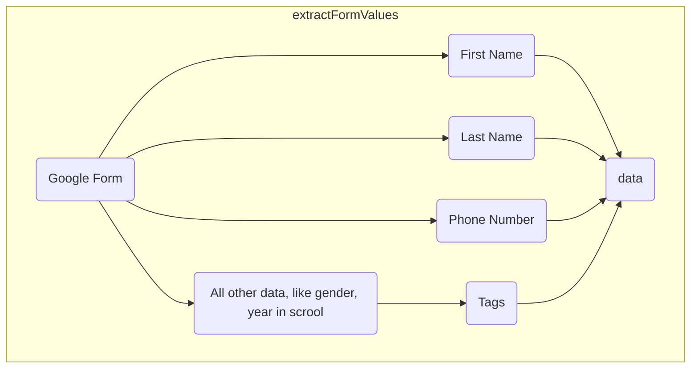
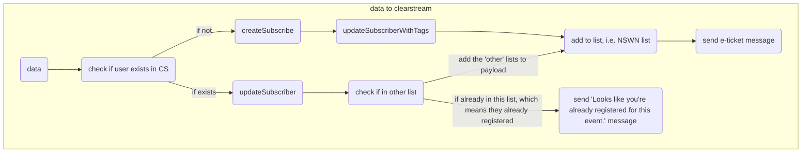

# Scripts used to transfer Google Form submissions to Clearstream

## Important Things Upfront

* [Clearstream Docs](https://api-docs.clearstream.io/)
* Clearstream API key [You can register an API key from inside your account.](https://app.clearstream.io/settings/api/keys)
* The scripts need to manually be imported to each Google form via script editor

## Notables

* The List's ID can be found in the url of the list in Clearstream (CS)
  * i.e. <https://app.clearstream.io/lists/239585> // 239585 is the id
* Tags need to be created in CS side before you can add it on the API side

## Sending Images via API

1. Upload image to google drive
2. Grab the file id from the url. For example, `1362JYBa2VyZBfg1oueLGVe_Q0Geb8QjE` is the file id for `https://drive.google.com/file/d/1362JYBa2VyZBfg1oueLGVe_Q0Geb8QjE/view`
3. Copy and paste file id to `uploadMediaToClearstream.js`

5. Run function and find the `media id` from the output

7. Copy and paste `media id` to `sendETicketMessage.js`

## Flowchart (if it helps)

